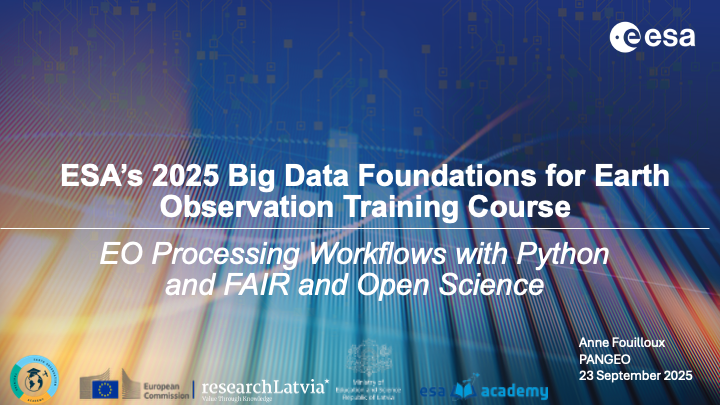

# BD4EO Course: EO Processing Workflows & FAIR Data


```{margin}
**Authors**: Anne Fouilloux  
**Affiliation**: Simula Research Laboratory  
**Course**: Big Data Foundations for Earth Observation  
**Location**: Riga  
**Sessions**: Tuesday, 09:10-10:30 & 11:00-12:00
```


Welcome to the course materials for understanding modern Earth Observation processing workflows and implementing FAIR (Findable, Accessible, Interoperable, Reusable) data principles in professional environments.

```{figure} images/main-QRcode.png
:width: 400px
QR-Code of the EO Processing Workflows & FAIR Data course material
```

## Course Overview

This course bridges the gap between technical EO processing capabilities and strategic data management approaches, designed specifically for **lecturers, industry professionals, and government representatives** who need to understand and implement modern EO workflows in their organizations.

## What Makes This Course Different

Rather than focusing purely on technical details, we emphasize:

* **Practical applications** showing how cloud-native EO processing solves real workflow challenges
* **FAIR principles awareness** applied specifically to Earth Observation contexts  
* **Operational examples** from ESA's platforms (EOPF, EarthCODE) demonstrating working implementations
* **Hands-on exploration** of modern tools and workflows you can continue using

## Session Structure

````{grid} 1 1 2 2
:gutter: 3

```{grid-item-card} Session 1: EO Processing Workflows & Python
:margin: 3
:text-align: center

**Tuesday 09:10-10:30 (80 minutes)**

Technical foundation demonstrating cloud-native EO processing, Python ecosystem, and operational workflows through live demonstrations of ESA services.

+++
[Go to Session 1 →](session-1/agenda.md)
```

```{grid-item-card} Session 2: FAIR Data & Open Science  
:margin: 3
:text-align: center

**Tuesday 11:00-12:00 (60 minutes)**

FAIR principles awareness applied to Earth Observation, 
with operational examples, readiness discussion, and 
introduction to implementation approaches.

+++
[Go to Session 2 →](session-2/agenda.md)
```
````
## Key Learning Outcomes

By completing this course, you will:
- Understand cloud-native EO processing and how it creates organizational value through improved efficiency and collaboration
- Experience modern Python tools and platforms through hands-on demonstrations relevant to your sector
- Assess your organization's current data management practices and identify improvement opportunities
- Design practical implementation strategies with realistic timelines and resource requirements
- Recognize how FAIR data principles can improve data utilization in your organizational context
- Evaluate technical solutions and platforms based on your specific operational needs
- Connect with expert communities and ongoing support resources for continued implementation
- Build professional relationships with peers facing similar data management challenges

## Interactive Learning Approach

This course combines multiple learning approaches:

- **Live Demonstrations:** Real-world exploration of ESA's EOPF Sample Service and EarthCODE platforms with hands-on Python examples
- **Interactive Discussions:** Group reflection on FAIR principles applied to Earth Observation contexts
- **Practical Examples:** Concrete EO workflow scenarios demonstrating cloud-native processing benefits
- **Resource Connections:** Introduction to ongoing professional communities and platforms for continued learning

## ESA Context

This course showcases ESA's comprehensive approach to modern EO processing and FAIR data implementation through operational examples:

- **[Cubes & Clouds](https://eo-college.org/courses/cubes-and-clouds)**: Educational excellence in cloud-native EO processing {cite}`cubes_clouds_2024`
- **[EOPF Sample Service](https://zarr.eopf.copernicus.eu/)**: Next-generation processing framework with Zarr optimization {cite}`eopf_sample_service`
- **[EarthCODE](https://earthcode.esa.int)**: Comprehensive FAIR implementation across the EO ecosystem {cite}`earthcode_2025`
- **[Copernicus Data Space](https://dataspace.copernicus.eu/)**: Operational cloud platform for EO data access and processing {cite}`copernicus_data_space`

## Prerequisites

**Essential:**
- General understanding of Earth Observation concepts and applications
- Familiarity with organizational data management challenges
- Interest in modernizing EO processing and data sharing approaches

**Helpful but not required:**
- Basic Python programming experience
- Knowledge of cloud computing concepts
- Experience with data management or open science initiatives

## Technical Requirements

To fully engage with the interactive elements:
- Modern web browser with JavaScript enabled
- Stable internet connection for cloud platform exploration
- Optional: Python environment for local notebook execution (see [requirements.txt](https://github.com/your-repo/bd4eo-course/blob/main/requirements.txt))

## Support and Community

**During the Course:**
- Real-time Q&A through shared Document (link to be provided by the instructor at the beginning of the course)
- Peer collaboration through group exercises

**After the Course:**
- Continued access to all course materials and updates
- EarthCODE Community support to publish datasets and workflows [EarthCODE Discourse Forum](https://discourse-earthcode.eox.at/)
- EOPF Community support to learn more about EOPF Zarr data format [EOPF Discourse](https://discourse.eopf.copernicus.eu)
- Worldwide network via [Pangeo Community](https://pangeo.io/) {cite}`pangeo_community` and ESA initiatives

## Acknowledgments

This course builds upon the collaborative efforts of the broader EO and open science communities, with special recognition to:
- ESA's Earth Observation Directorate for operational service examples
- Pangeo community {cite}`pangeo_community` for cloud-native processing tools and practices
- FAIR data initiative leaders {cite}`wilkinson2016fair` for strategic frameworks
- International Earth observation community for standards and best practices

## License and Reuse

These course materials are made available under **Creative Commons Attribution 4.0 (CC-BY)** license, following the FAIR principles {cite}`wilkinson2016fair` demonstrated throughout the course. You are encouraged to:
- Reuse and adapt materials for your educational or organizational needs
- Share improvements and extensions with the community
- Cite appropriately when building upon this content
- Contribute feedback and suggestions for continuous improvement

---

## Bibliography

```{bibliography}
```
