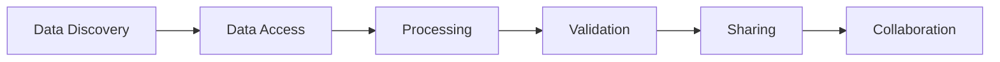

# Session 1: EO Processing Workflows & Python for EO

**Duration:** 80 minutes (09:10-10:30)  
**Format:** Interactive presentation with live demonstrations  
**Target Audience:** Lecturers, industry professionals, government representatives

## Learning Objectives

By the end of this session, participants will:
- Understand the evolution from traditional to cloud-native EO processing
- Recognize the role of Python in modern EO workflows
- Appreciate the benefits of data cubes and cloud platforms
- See real-world examples of operational EO processing systems

## Session Overview

```{admonition} Interactive Elements
:class: tip
- **Live demonstrations** of ESA's operational tools
- **Real-time Q&A** via shared Google Doc
- **Hands-on exploration** of cloud platforms
- **Group discussions** on workflow challenges
```

---

## Part 1: Modern EO Processing Landscape
*Duration: 20 minutes (09:15-09:35)*

### The Challenge: EO Data Growth

Earth Observation is experiencing unprecedented data growth:
- **Volume**: Petabytes of new satellite data daily
- **Velocity**: Near real-time processing requirements  
- **Variety**: Multiple sensors, formats, and resolutions
- **Veracity**: Quality assessment and validation needs

### From Desktop to Cloud

**Traditional EO Processing:**
```
Download → Store Locally → Process → Analyze → Share
```
**Limitations:**
- Storage constraints
- Processing bottlenecks
- Version control issues
- Limited collaboration

**Modern Cloud-Native Processing:**
```
Discover → Access in Cloud → Process at Scale → Collaborate → Share
```
**Advantages:**
- Elastic computing resources
- Co-located data and compute
- Version-controlled workflows
- Real-time collaboration

### Introduction to Data Cubes

A **data cube** organizes EO data along multiple dimensions:
- **X, Y**: Spatial coordinates (longitude, latitude)
- **Time**: Temporal dimension
- **Bands**: Spectral dimensions
- **Attributes**: Metadata and quality indicators

```{figure} https://datacube-core.readthedocs.io/en/latest/_images/cube_slicing.png
:name: datacube-concept
:width: 600px

Data cube concept showing spatial and temporal dimensions
```

**Benefits of Data Cubes:**
- **Analysis Ready Data (ARD)**: Pre-processed, calibrated, orthorectified
- **Efficient Access**: Query specific space-time-band subsets
- **Scalable Processing**: Leverage parallel computing
- **Standardized APIs**: Consistent access patterns

### Live Demo: Cubes & Clouds Snow Mapping

Let's explore ESA's community-driven snow mapping project:

🔗 **[Interactive Snow Cover Map](https://esa.pages.eox.at/cubes-and-clouds-catalog/browser/)**

**What to observe:**
- Geographic coverage and temporal extent
- Data discovery through STAC browser
- Community contributions and methodology
- Integration of multiple data sources

```{admonition} Discussion Point
:class: note
How could similar community-driven approaches benefit your organization's EO applications?
```

---

## Part 2: Python Ecosystem for EO
*Duration: 25 minutes (09:35-10:00)*

### Core Python Libraries

Python has become the lingua franca of EO processing through powerful libraries:

#### **Xarray**: N-dimensional labeled arrays
```python
import xarray as xr

# Open a NetCDF file with coordinate information
ds = xr.open_dataset('sentinel2_data.nc')

# Select data for specific time and location
subset = ds.sel(time='2023-06-15', 
                lon=slice(20, 25), 
                lat=slice(55, 60))
```

**Key features:**
- Label-based indexing and selection
- Automatic alignment of datasets
- Integration with Pandas and NumPy
- Built-in visualization capabilities

#### **Dask**: Parallel computing for larger-than-memory arrays
```python
import dask.array as da

# Create chunked arrays for parallel processing
data = da.from_array(large_satellite_image, chunks=(1024, 1024))

# Lazy evaluation - computation happens when needed
result = data.mean(axis=0).compute()
```

**Benefits:**
- Process datasets larger than RAM
- Automatic parallelization
- Familiar NumPy-like interface
- Scales from laptops to clusters

#### **Rasterio**: Geospatial raster I/O
```python
import rasterio
from rasterio.plot import show

# Read geospatial raster data
with rasterio.open('landsat_scene.tif') as src:
    data = src.read()
    show(data)
```

#### **GeoPandas**: Geospatial vector operations
```python
import geopandas as gpd

# Read vector data and perform spatial operations
boundaries = gpd.read_file('study_areas.geojson')
intersections = boundaries.overlay(other_layer, how='intersection')
```

### Cloud Platform Integration

Modern EO processing leverages cloud platforms for scalability:

#### **Copernicus Data Space Ecosystem**
- **130+ TB** of Copernicus data
- **Processing services** co-located with data
- **Jupyter environments** for development
- **API access** for automation

#### **STAC (SpatioTemporal Asset Catalog)**
```python
import pystac_client

# Search for Sentinel-2 data
catalog = pystac_client.Client.open("https://earth-search.aws.element84.com/v0")
search = catalog.search(
    collections=["sentinel-s2-l2a-cogs"],
    bbox=[23.5, 56.0, 24.5, 57.0],
    datetime="2023-06-01/2023-06-30"
)
```

**STAC Benefits:**
- **Standardized metadata** across providers
- **Efficient discovery** of relevant datasets
- **Interoperable catalogs** between platforms
- **API-based access** for automation

### Live Demo: Python Ecosystem in Action

Let's see these tools working together in a real workflow:

```{code-cell}
# This will be demonstrated live
import xarray as xr
import matplotlib.pyplot as plt
import cartopy.crs as ccrs

# Example: Loading and visualizing EO data
ds = xr.tutorial.open_dataset("air_temperature")
ds.air.isel(time=0).plot(transform=ccrs.PlateCarree(), 
                         subplot_kws={"projection": ccrs.PlateCarree()})
plt.title("Example EO Data Visualization")
plt.show()
```

---

## Part 3: EOPF Sample Service Demonstration
*Duration: 25 minutes (10:00-10:25)*

### Introduction to EOPF

The **Earth Observation Processing Framework (EOPF)** represents ESA's next-generation approach to EO data processing:

🔗 **[EOPF Sample Service](https://zarr.eopf.copernicus.eu/)**

**Key innovations:**
- **Zarr format**: Cloud-optimized array storage
- **Harmonized data access**: Consistent APIs across missions
- **Scalable processing**: From laptop to HPC
- **Open source**: Community-driven development

### Zarr Format Advantages

Zarr is a modern format for chunked, compressed N-dimensional arrays:

```python
import zarr
import xarray as xr

# Open Zarr dataset directly from cloud storage
ds = xr.open_zarr('https://cloud-storage/sentinel2-data.zarr')

# Efficient access to subset without downloading entire dataset
subset = ds.sel(time='2023-06-15').load()
```

**Performance benefits:**
- **Chunked storage**: Access only needed data pieces
- **Compression**: Reduced storage and transfer costs
- **Parallel I/O**: Concurrent access to chunks
- **Cloud-native**: Works efficiently with object storage

### Live Demo: EOPF Notebooks

Let's explore the EOPF sample notebooks:

🔗 **[EOPF Notebook Gallery](https://eopf-sample-service.github.io/eopf-sample-notebooks/)**

**Notebooks to explore:**
1. **Basic data access**: Loading Sentinel data in Zarr format
2. **Time series analysis**: Multi-temporal processing
3. **Spectral analysis**: Working with hyperspectral data
4. **Integration examples**: Combining multiple datasets

### STAC Browser Exploration

🔗 **[EOPF STAC Browser](https://stac.browser.user.eopf.eodc.eu)**

**Features to highlight:**
- **Interactive map interface**: Visual data discovery
- **Temporal filtering**: Find data for specific time periods
- **Metadata browsing**: Understand dataset characteristics
- **Direct access links**: Connect to processing environments

```{admonition} Try This
:class: tip
During the demo, try searching for data over your area of interest. Notice how the STAC interface makes it easy to discover relevant datasets.
```

---

## Part 4: End-to-End Workflow Integration
*Duration: 25 minutes (10:00-10:25)*

### Complete EO Processing Pipeline

Modern EO workflows follow a consistent pattern:



#### **1. Data Discovery**
- **STAC catalogs**: Standardized metadata search
- **Spatial/temporal filtering**: Find relevant datasets
- **Quality assessment**: Check data characteristics

#### **2. Data Access**
- **Cloud-optimized formats**: Zarr, COG (Cloud Optimized GeoTIFF)
- **Streaming access**: Read only needed portions
- **Authentication**: Secure access to commercial data

#### **3. Processing**
- **Scalable computing**: Dask for parallelization
- **Standard algorithms**: SNAP, OTB (Orfeo ToolBox)
- **Custom workflows**: Domain-specific processing

#### **4. Validation**
- **Quality metrics**: Statistical validation
- **Visual inspection**: Interactive plots and maps
- **Comparison studies**: Against reference data

#### **5. Sharing**
- **Standard formats**: NetCDF, GeoTIFF, Zarr
- **Metadata standards**: ISO19115, STAC
- **Version control**: Git for reproducibility

### Operational Example: Sentinel-2 Processing

Let's trace a complete workflow using ESA's operational systems:

```python
# 1. Discovery using STAC
import pystac_client
catalog = pystac_client.Client.open("https://earth-search.aws.element84.com/v0")
items = catalog.search(
    collections=["sentinel-s2-l2a-cogs"],
    bbox=[your_bbox],
    datetime="2023-06-01/2023-06-30"
).item_collection()

# 2. Access using xarray
import xarray as xr
import rioxarray
ds = xr.open_dataset(items[0].assets['red'].href, engine='rasterio')

# 3. Process using standard algorithms
ndvi = (ds.sel(band=4) - ds.sel(band=3)) / (ds.sel(band=4) + ds.sel(band=3))

# 4. Validate results
ndvi.plot(title="NDVI Analysis")

# 5. Share using standard formats
ndvi.to_netcdf('ndvi_result.nc')
```

### Integration with Business Workflows

For organizations, EO processing must integrate with existing systems:

**Government Applications:**
- **Policy monitoring**: Environmental compliance tracking
- **Emergency response**: Rapid damage assessment
- **Urban planning**: Land use change detection

**Industry Applications:**
- **Agriculture**: Crop monitoring and yield prediction
- **Insurance**: Risk assessment and claims validation
- **Energy**: Infrastructure monitoring and planning

**Education Applications:**
- **Student projects**: Hands-on learning with real data
- **Research collaboration**: Multi-institutional studies
- **Curriculum development**: Up-to-date content delivery

---

## Wrap-up & Key Takeaways
*Duration: 5 minutes (10:25-10:30)*

### Session Summary

**What we've covered:**
1. **Evolution of EO processing** from desktop to cloud-native approaches
2. **Python ecosystem** as the foundation for modern EO workflows
3. **Real-world examples** through ESA's operational systems
4. **Complete workflow integration** from discovery to sharing

### Key Messages

```{admonition} Core Takeaways
:class: important
- **Cloud-native processing** is essential for handling modern EO data volumes
- **Python ecosystem** provides powerful, interoperable tools for EO analysis
- **Standardization** (STAC, Zarr, etc.) enables seamless workflow integration
- **Open source approaches** accelerate innovation and reduce costs
```

### Looking Ahead

This session provides the technical foundation for:
- **Session 2**: FAIR data principles that make these workflows sustainable
- **Wednesday**: AI/ML applications that build on standardized data
- **Thursday**: Business innovations enabled by robust data infrastructure

### Interactive Elements

```{admonition} Join the Discussion
:class: note
- **Live Q&A**: Continue questions in our shared Google Doc
- **Hands-on exploration**: Try the tools and platforms demonstrated
- **Networking**: Connect with peers facing similar challenges
```

---

## Resources & Further Reading

### Essential Links
- **[Cubes & Clouds Course](https://eo-college.org/courses/cubes-and-clouds)**: Complete online curriculum
- **[EOPF Sample Service](https://zarr.eopf.copernicus.eu/)**: Hands-on notebooks and examples
- **[Copernicus Data Space](https://dataspace.copernicus.eu/)**: Free access to EO data and processing
- **[Pangeo Community](https://pangeo.io/)**: Open-source tools for big data geoscience

### Technical Documentation
- **[Xarray Documentation](https://docs.xarray.dev/)**: Comprehensive guide to labeled arrays
- **[Dask Documentation](https://docs.dask.org/)**: Parallel computing in Python
- **[STAC Specification](https://stacspec.org/)**: Metadata standards for EO data
- **[Zarr Documentation](https://zarr.readthedocs.io/)**: Cloud-optimized array storage

### Community Resources
- **[Pangeo Discourse](https://discourse.pangeo.io/)**: Community discussions and support
- **[EO College](https://eo-college.org/)**: Educational resources and courses
- **[CEOS OpenSearch](https://opensearch.ceos.org/)**: Global EO data discovery

---

## Interactive Session Notes

```{admonition} Live Collaboration
:class: tip
Use our shared Google Doc for:
- Real-time questions during presentations
- Notes from live demonstrations
- Discussion of workflow challenges
- Resource sharing among participants

**Google Doc Link**: [Session 1 Collaborative Notes](your-google-doc-link)
```
